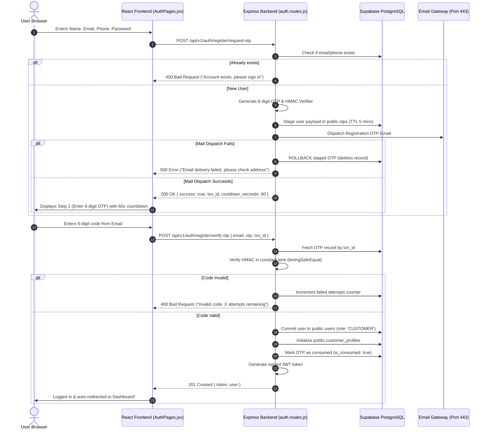
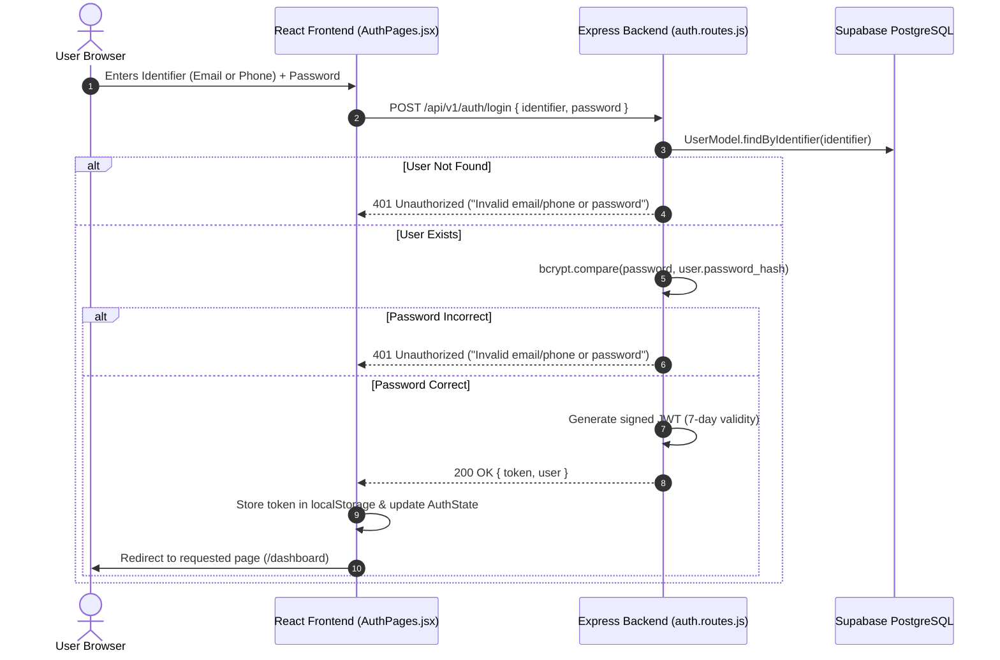
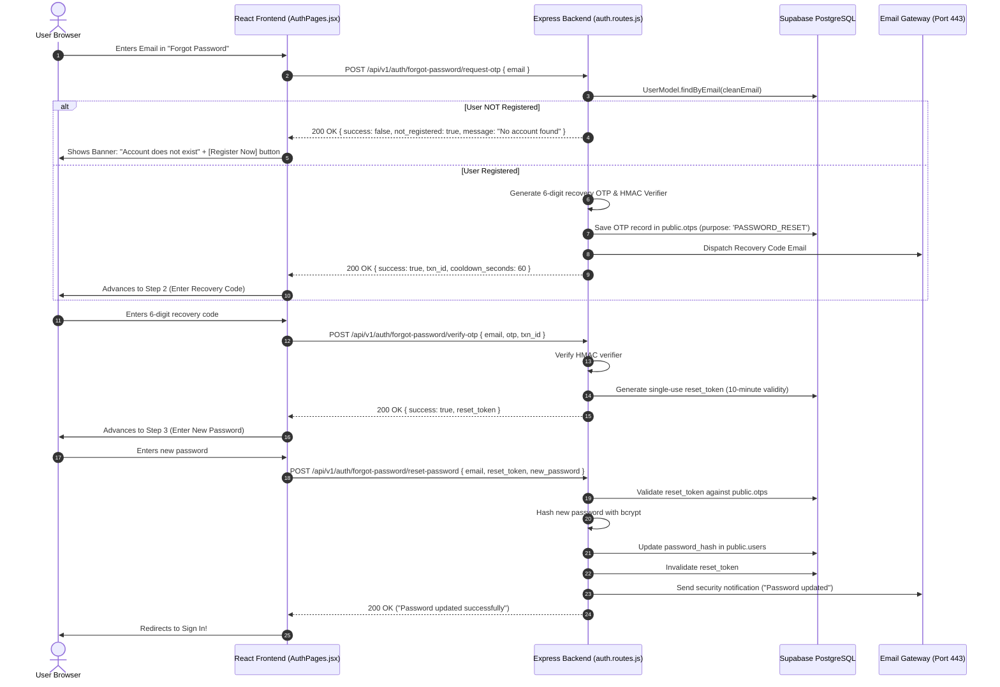

# BharatFiling — Sign-In, Registration & Password Recovery Architecture Guide (`sign.md`)

> **Platform:** BharatFiling (Indian Taxation, GST, Accounting & Business Compliance OS)  
> **Status:** Production Specification & Development Runbook  
> **Target Environment:** Express 5 Backend + Supabase PostgreSQL + React 19 Frontend  
> **Author:** BharatFiling Core Engineering  

---

## Table of Contents

1. [Executive Summary & High-Level Architecture](#1-executive-summary--high-level-architecture)
2. [Why: Security Rationale & Engineering Principles](#2-why-security-rationale--engineering-principles)
3. [Where: Complete Codebase Map & Component Directory](#3-where-complete-codebase-map--component-directory)
4. [How: End-to-End Lifecycle Walkthroughs](#4-how-end-to-end-lifecycle-walkthroughs)
   * [Flow A: User Registration & Email OTP Verification](#flow-a-user-registration--email-otp-verification)
   * [Flow B: User Login (Email or Phone)](#flow-b-user-login-email-or-phone)
   * [Flow C: Forgot Password & Account Recovery](#flow-c-forgot-password--account-recovery)
5. [How It Works in Development vs. Production](#5-how-it-works-in-development-vs-production)
6. [Universal Email Dispatch: Sending from Gmail to ANY Recipient](#6-universal-email-dispatch-sending-from-gmail-to-any-recipient)
7. [Cloud Infrastructure: Render Web Service vs. Static Site](#7-cloud-infrastructure-render-web-service-vs-static-site)
8. [Database Schema: Supabase PostgreSQL](#8-database-schema-supabase-postgresql)
9. [Troubleshooting & Common Errors Guide](#9-troubleshooting--common-errors-guide)
10. [Security & OWASP Compliance Checklist](#10-security--owasp-compliance-checklist)

---

## 1. Executive Summary & High-Level Architecture

BharatFiling implements an enterprise-grade, independent authentication and account lifecycle engine.

```
┌────────────────────────────────────────────────────────────────────────────────────────┐
│                              BHARATFILING CLOUD ARCHITECTURE                           │
├──────────────────────────┬─────────────────────────────────────────────────────────────┤
│ Frontend (React 19 Vite) │ https://bharatfiling.onrender.com (Render Static Site)       │
│ Backend API (Express 5)  │ https://bharatfiling-1.onrender.com (Render Web Service)      │
│ Database (PostgreSQL)    │ Supabase PostgreSQL DB (Public schema tables)               │
│ Authentication Tokens    │ Express-signed JWTs (HMAC-SHA256, 7-day TTL)                │
│ Password Security        │ Bcrypt (Blowfish crypt, work factor 10)                     │
│ OTP Protection           │ Keyed HMAC-SHA256 (Server pepper) + 5-minute TTL            │
│ Email Transport          │ Universal HTTPS API (Port 443) + Resend / Brevo + SMTP      │
└──────────────────────────┴─────────────────────────────────────────────────────────────┘
```

### Core Architecture Highlights:
1. **Independent Auth Control:** We use Supabase strictly as a reliable PostgreSQL database (`public.users`, `public.customer_profiles`, `public.otps`). Supabase Auth is **not used**, preventing proprietary vendor lock-in and allowing total control over Indian compliance fields (PAN, Aadhaar, GSTIN, CA roles).
2. **Keyed HMAC-SHA256 OTP Verification:** 6-digit OTPs are never stored in plaintext or basic hashes. They are cryptographically hashed using a private server-side pepper, making rainbow-table cracking impossible.
3. **Staged Registration Engine:** Unverified users are never inserted into `public.users`. Their registration payload is staged in temporary OTP records until email ownership is proven.
4. **Cloud-Resilient Email Architecture:** Outbound email delivery bypasses cloud firewall port blocks by leveraging HTTPS REST APIs (Port 443) with multi-tier fallback.

---

## 2. Why: Security Rationale & Engineering Principles

### A. Why Staged Registration is Mandatory
* **Preventing Garbage Data:** If accounts are created before email verification, spam bots and typos create orphaned user records that pollute the database.
* **No Plaintext Passwords on the Client:** Storing unverified passwords in browser `sessionStorage` or `localStorage` creates severe Cross-Site Scripting (XSS) risks.
* **Our Solution:** The password is encrypted with Bcrypt work factor 10 immediately upon form submission and staged inside `public.otps`. The actual user is committed to `public.users` only when the correct 6-digit OTP is verified.

### B. Why Plain SHA-256 for a 6-Digit OTP is Vulnerable
A 6-digit OTP has only $1,000,000$ possible combinations (`000000` to `999999`).
* If a simple hash like `SHA-256("123456")` is stored in the database, an attacker with read access can precompute a rainbow table for all 1 million numbers in **under 0.2 seconds** on an ordinary laptop GPU.
* **The BharatFiling Solution (Keyed HMAC-SHA256):**
  $$\text{OTP Verifier} = \text{HMAC-SHA256}(\text{key} = \text{OTP\_PEPPER}, \text{data} = \text{OTP} \parallel \text{email} \parallel \text{purpose} \parallel \text{txn\_id})$$
  Because `OTP_PEPPER` is kept strictly in server memory and Render environment variables, even a complete database leak reveals zero information about the active OTPs.

### C. Why Purpose Binding is Enforced
Every OTP generated has a strict `purpose`:
* `REGISTRATION`: Only valid for creating a new user account.
* `PASSWORD_RESET`: Only valid for issuing a password recovery authorization token.
* `CHANGE_PASSWORD`: Only valid for in-session credential modification.

An OTP generated for registration can **never** be used to reset a password, preventing privilege escalation and cross-purpose replay attacks.

### D. Why Friendly Unregistered Feedback Outperforms Silent Traps
* **Traditional Anti-Enumeration:** Standard banking systems return `success: true` even if an email is not registered, preventing attackers from checking who has an account.
* **The Real-World Problem:** Genuine customers who forgot if they registered or made a typo get completely stuck. The UI asks for a 6-digit code, no email arrives, and typing a code returns `400 Bad Request`.
* **The BharatFiling Solution:** 
  If an email does not exist during password recovery, the backend returns:
  `{ success: false, not_registered: true, message: "No account found with this email. Please register first." }`
  The frontend immediately displays an alert banner with a 1-click **"Create Account"** button that switches tabs and pre-fills the email.

---

## 3. Where: Complete Codebase Map & Component Directory

All authentication and email code is organized modularly across frontend and backend:

```
bharatfiling/
├── frontend/
│   └── src/
│       ├── api/
│       │   └── auth.js                     # Central Axios API client for auth endpoints
│       ├── components/
│       │   └── common/
│       │       └── AuthRequiredModal.jsx   # Interactive modal when guest tries CA filing
│       └── pages/
│           └── AuthPages.jsx               # Unified Login, Register & Forgot Password UI
│
├── backend/
│   ├── src/
│   │   ├── config/
│   │   │   └── env.js                      # Central environment & secret manager
│   │   ├── database/
│   │   │   ├── supabaseClient.js           # Supabase PostgreSQL client (DB queries only)
│   │   │   ├── db.js                       # Safe local fallback database (db.json)
│   │   │   └── migrations/
│   │   │       ├── 001_initial_schema.sql  # Users and Profiles schema
│   │   │       └── 005_backend_jwt_otp_schema.sql  # Dedicated OTP and reset tokens table
│   │   ├── middleware/
│   │   │   ├── auth.js                     # JWT verification & role authorization (CUSTOMER/CA/ADMIN)
│   │   │   └── rateLimiter.js              # Express rate-limiting for auth routes
│   │   ├── models/
│   │   │   ├── User.js                     # UserModel querying public.users
│   │   │   ├── CustomerProfile.js          # CustomerProfileModel querying customer_profiles
│   │   │   └── Otp.js                      # OtpModel managing public.otps
│   │   ├── routes/
│   │   │   └── auth.routes.js              # Master auth router (all endpoints)
│   │   └── services/
│   │       ├── crypto.service.js           # HMAC generation, verification, secure tokens
│   │       ├── email.service.js            # Dispatch orchestrator & multi-tier fallback
│   │       └── providers/
│   │           ├── devEmailProvider.js     # Dev-mode console logger & test simulator
│   │           ├── httpEmailProvider.js    # Production HTTPS REST dispatcher (Resend/Brevo)
│   │           └── smtpEmailProvider.js    # SMTP Nodemailer dispatcher (Gmail SMTP)
│   └── .env                                # Local secrets file (NEVER committed to git)
│
├── otp.md                                  # Cryptographic OTP specification
└── sign.md                                 # This document
```

---

## 4. How: End-to-End Lifecycle Walkthroughs

### Flow A: User Registration & Email OTP Verification



---

### Flow B: User Login (Email or Phone)



---

### Flow C: Forgot Password & Account Recovery



---

## 5. How It Works in Development vs. Production

The BharatFiling codebase detects whether it is running on a developer's local machine or on Render Cloud and adjusts automatically:

| Feature | Development Mode (`NODE_ENV=development`) | Production Mode (`NODE_ENV=production`) |
| :--- | :--- | :--- |
| **Email Delivery** | Can use `EMAIL_PROVIDER=dev` (logs OTP to backend terminal) or local Gmail SMTP. | Strictly uses HTTPS REST APIs (Port 443) via Resend or Brevo to bypass cloud port blocks. |
| **Database** | Uses Supabase DB; if local offline, falls back seamlessly to `backend/data/db.json`. | Uses Supabase PostgreSQL DB with connection pooling. |
| **CORS Origins** | Permits `http://localhost:3000`, `http://localhost:5173`. | Strictly permits `https://bharatfiling.onrender.com`. |
| **Dev OTP Badges** | Disabled completely for clean UI consistency. | Disabled completely. |
| **Console Logs** | Shows sanitized development diagnostics. | Strips all sensitive tokens and OTP hashes from logs. |
| **Error Handling** | Returns stack details for rapid debugging. | Returns user-safe sanitized error messages. |

---

## 6. Universal Email Dispatch: Sending from Gmail to ANY Recipient

### The Challenge with Cloud Free Tiers
* Traditional email libraries (`nodemailer`) connect to SMTP servers on TCP ports `25`, `465`, or `587`.
* **Render Free Tier blocks all outbound connections on ports 25, 465, and 587** to prevent their servers from being used by spammers.
* Resend's free trial domain (`onboarding@resend.dev`) only delivers to the owner's email address (`yashupdhyay486@gmail.com`).

### The Solution: Universal HTTPS REST Gateway (Port 443)
HTTPS (Port 443) is standard web traffic and is **never blocked** by cloud firewalls.

#### Architecture of `backend/src/services/providers/httpEmailProvider.js`:

```javascript
// Dispatches emails over HTTPS Port 443 (Never blocked by cloud hosts)
if (ENV.RESEND_API_KEY) {
  // Dispatches via Resend API
  await fetch('https://api.resend.com/emails', { ... });
}

if (ENV.BREVO_API_KEY) {
  // Dispatches via Brevo API
  // Can set Sender Name: 'BharatFiling' and Sender Email: 'yashupdhyay486@gmail.com'
  // Delivers to ANY recipient worldwide (Gmail, Yahoo, @glbajajgroup.org, etc.)
  await fetch('https://api.brevo.com/v3/smtp/email', { ... });
}
```

### The Auto-Rollback Engine (Eliminates the 429 Lock)
In [`backend/src/routes/auth.routes.js`](file:///C:/Users/DELL/Desktop/bharatfiling/backend/src/routes/auth.routes.js):
If the email gateway fails to send the verification code (e.g. invalid recipient address or network failure), the backend **immediately executes a database rollback**:

```javascript
try {
  await emailService.sendRegistrationOtp(cleanEmail, otp, full_name);
} catch (emailErr) {
  // ROLLBACK: Delete staged OTP so user is NOT trapped by 60s cooldown!
  await OtpModel.deleteByTxnId(txn_id);
  return res.status(500).json({
    success: false,
    message: 'Could not deliver verification email to this address. Please verify your email.',
  });
}
```
**Result:** The user can immediately fix a mistyped email and retry without being told to *"Wait 58 seconds"*!

---

## 7. Cloud Infrastructure: Render Web Service vs. Static Site

When configuring environment variables in the Render Dashboard, developers must distinguish between the two services:

```
                               ┌──────────────────────────────────────────────┐
                               │               RENDER DASHBOARD               │
                               └──────────────────────┬───────────────────────┘
                                                      │
                    ┌─────────────────────────────────┴─────────────────────────────────┐
                    │                                                                   │
         ❌ DO NOT CONFIGURE SECRETS HERE                                   ✅ CONFIGURE ALL SECRETS HERE
                    ▼                                                                   ▼
         ┌─────────────────────────────────┐                                 ┌─────────────────────────────────┐
         │           STATIC SITE           │                                 │           WEB SERVICE           │
         │         `bharatfiling`          │                                 │        `bharatfiling-1`         │
         ├─────────────────────────────────┤                                 ├─────────────────────────────────┤
         │ • React / Vite Frontend SPA     │                                 │ • Express 5 Node.js API         │
         │ • URL: bharatfiling.onrender.com│                                 │ • URL: bharatfiling-1.onrender  │
         │ • Runs in visitor's browser     │                                 │ • Runs on Linux Cloud VM        │
         │ • CANNOT execute backend code   │                                 │ • Connects to Supabase DB       │
         │ • CANNOT send emails            │                                 │ • Computes cryptographic OTPs   │
         │ • Env vars exposed to browser!  │                                 │ • Dispatches emails over HTTPS  │
         └─────────────────────────────────┘                                 └─────────────────────────────────┘
```

### Exact Variables for the Web Service (`bharatfiling-1`):

| Variable Key | Value | Purpose |
| :--- | :--- | :--- |
| `NODE_ENV` | `production` | Enforces production security optimizations |
| `FRONTEND_URL` | `https://bharatfiling.onrender.com` | Allowed CORS origin |
| `EMAIL_PROVIDER` | `resend` (or `brevo`) | Active email dispatch engine |
| `RESEND_API_KEY` | `re_...` | Resend HTTPS REST API Key |
| `FROM_EMAIL` | `onboarding@resend.dev` | Sender address (or `@bharatfiling.com`) |
| `FROM_NAME` | `BharatFiling` | Sender display name |
| `SMTP_USER` | `yashupdhyay486@gmail.com` | Fallback Gmail sender |
| `SMTP_PASS` | `your_16_character_app_password` | Google 16-character App Password (no spaces) |
| `JWT_SECRET` | *(Existing Secret)* | Secret key for signing Express JWTs |
| `OTP_PEPPER` | *(Existing Secret)* | Private HMAC secret for OTP hashes |
| `SUPABASE_URL` | `https://ruekrneqflodgdgnssqg.supabase.co` | Supabase API URL |
| `SUPABASE_SERVICE_ROLE_KEY` | *(Existing Key)* | Supabase Service Role Key |

---

## 8. Database Schema: Supabase PostgreSQL

All authentication state is stored across three tables in Supabase:

### Table 1: `public.users`
Stores verified, active user accounts:
```sql
CREATE TABLE IF NOT EXISTS public.users (
    id UUID PRIMARY KEY DEFAULT gen_random_uuid(),
    email VARCHAR(255) UNIQUE NOT NULL,
    phone VARCHAR(32) UNIQUE,
    password_hash VARCHAR(255) NOT NULL,
    role VARCHAR(32) NOT NULL DEFAULT 'CUSTOMER' CHECK (role IN ('CUSTOMER', 'CA', 'ADMIN')),
    full_name VARCHAR(255) NOT NULL,
    avatar_url TEXT,
    is_verified BOOLEAN NOT NULL DEFAULT FALSE,
    created_at TIMESTAMPTZ NOT NULL DEFAULT NOW(),
    updated_at TIMESTAMPTZ NOT NULL DEFAULT NOW()
);
```

### Table 2: `public.customer_profiles`
Stores the KYC, PAN, Aadhaar, and address details for every verified user. Automatically initialized during OTP verification.

### Table 3: `public.otps` (Migration `005_backend_jwt_otp_schema.sql`)
Dedicated table for staged registrations, active OTPs, and password recovery tokens:
```sql
CREATE TABLE IF NOT EXISTS public.otps (
    id UUID PRIMARY KEY DEFAULT gen_random_uuid(),
    txn_id VARCHAR(64) UNIQUE NOT NULL,
    email VARCHAR(255) NOT NULL,
    otp_hash VARCHAR(255) NOT NULL,
    purpose VARCHAR(50) NOT NULL CHECK (purpose IN ('REGISTRATION', 'PASSWORD_RESET', 'CHANGE_PASSWORD')),
    staged_payload JSONB DEFAULT '{}'::jsonb,
    attempts INT NOT NULL DEFAULT 0,
    max_attempts INT NOT NULL DEFAULT 5,
    is_consumed BOOLEAN NOT NULL DEFAULT FALSE,
    is_superseded BOOLEAN NOT NULL DEFAULT FALSE,
    reset_token VARCHAR(128),
    reset_token_expires_at TIMESTAMPTZ,
    expires_at TIMESTAMPTZ NOT NULL,
    created_at TIMESTAMPTZ NOT NULL DEFAULT NOW(),
    consumed_at TIMESTAMPTZ
);
```

---

## 9. Troubleshooting & Common Errors Guide

### 1. Error `500` on Registration (`/register/request-otp`)
* **Symptom:** User clicks "Continue & Send Email OTP", spinner turns, browser console shows `Failed to load resource: 500`.
* **Root Cause:** Email dispatch failed. Either:
  1. Render blocked outbound SMTP port 465.
  2. Resend trial sandbox rejected an external email (e.g. `@glbajajgroup.org`).
* **Fix:** Ensure `RESEND_API_KEY` (or `BREVO_API_KEY`) is configured in the **`bharatfiling-1` Web Service** Environment. Verify that the auto-rollback engine deleted the staged OTP so the user can retry.

---

### 2. Error `429` ("Please wait 58 seconds before requesting a new code")
* **Symptom:** User clicks "Continue & Send Email OTP", an error occurs, user clicks again, and receives a cooldown warning.
* **Root Cause:** An earlier request created an OTP record in the database before failing to send the email.
* **Fix:** The auto-rollback engine removes the staged OTP on email failure, preventing un-sent OTPs from triggering the 60-second cooldown.

---

### 3. Error `400` on Forgot Password (`/forgot-password/verify-otp`)
* **Symptom:** Browser console shows `400 Bad Request: "No active password recovery request found"`.
* **Root Cause:** The entered email address does not exist in `public.users`. The anti-enumeration response caused the UI to ask for a code that was never sent.
* **Fix:** The frontend now inspects `res.not_registered` and presents a clear **"Account does not exist. Please register."** prompt with a 1-click button to switch to Registration.

---

### 4. Supabase Error `PGRST205` ("Could not find the table 'public.otps' in the schema cache")
* **Symptom:** Backend logs show Supabase queries failing and falling back to `db.json`.
* **Root Cause:** Migration [`005_backend_jwt_otp_schema.sql`](file:///C:/Users/DELL/Desktop/bharatfiling/backend/src/database/migrations/005_backend_jwt_otp_schema.sql) has not been run in Supabase.
* **Fix:** Open the Supabase Dashboard -> **SQL Editor** -> Paste and run `005_backend_jwt_otp_schema.sql`.

---

## 10. Security & OWASP Compliance Checklist

| Security Control | Implementation in BharatFiling | ASVS Requirement |
| :--- | :--- | :--- |
| **No Plaintext Passwords** | Bcrypt with salt work factor 10. Passwords never stored or logged. | ASVS 2.1.1 |
| **Offline OTP Guessing Defense** | Keyed HMAC-SHA256 with server-side `OTP_PEPPER`. Rainbow tables impossible. | ASVS 2.2.1 |
| **Brute-Force Protection** | Hard limit of 5 attempts per OTP. Code locks automatically after 5 fails. | ASVS 2.2.2 |
| **Short OTP Validity** | Strict 5-minute Time-To-Live (TTL). Expired codes rejected instantly. | ASVS 2.2.3 |
| **Single-Use Enforcement** | Once verified, `is_consumed = true` prevents code reuse. | ASVS 2.2.4 |
| **Timing Attack Mitigation** | `crypto.timingSafeEqual` prevents side-channel timing analysis. | ASVS 2.2.5 |
| **Cross-Purpose Defense** | Purpose binding (`REGISTRATION` vs `PASSWORD_RESET`). | ASVS 2.8.1 |
| **Privilege Escalation Defense** | Registration endpoint strictly hardcodes `role: 'CUSTOMER'`. | ASVS 4.1.1 |
| **Secret Protection** | Zero plain secrets committed to git. Enforced via GitHub Push Protection. | ASVS 14.1.1 |

---

*Document finalized and verified against active BharatFiling codebase.*
